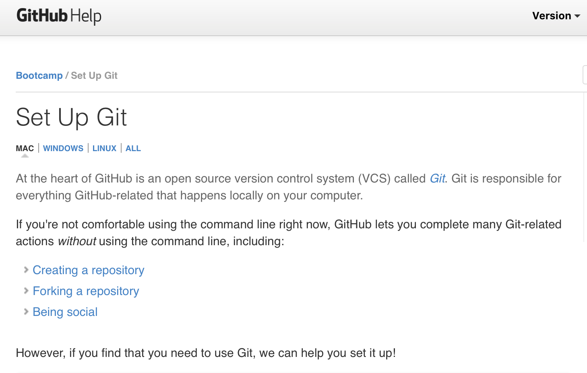

<!--
.. title: Set Up
.. slug: set-up
.. date: 2016-10-17 04:27:01 UTC-07:00
.. tags: 
.. category: 
.. link: 
.. description: 
.. type: text
-->

Conference wifi can be spotty at times. If you are able to install
these items before Open Source Day, that would be great. If you are not
able we'll have a way for you to do so at the event.

## Editor

You will need to have a code editor installed on your system. There are
many available that are open source. Two user friendly editors are:

- [Atom](https://atom.io)
- [Visual Studio Code](https://code.visualstudio.com/)

## GitHub and git

[GitHub Help pages](https://help.github.com)

1. Create a [GitHub account](https://help.github.com/articles/set-up-git/)
   if you do not already have one.

   
   
2. Make sure git is installed on your system.
3. From the command line (terminal), enter `git --version`. If git is
   installed on your system and its PATH, it will display git's version.
   
   
## Command line (Terminal)

## Jupyter Notebook

1. Download the [Anaconda installer](https://www.continuum.io/downloads)
   for your operating system. FYI...most modern computers are 64 bit.

2. Run the installer.

3. Download the [conda cheatsheet](http://conda.pydata.org/docs/_downloads/conda-cheatsheet.pdf)

---

## Documentation, help, and cheatsheets

* Command line basics
    - [cheatsheet]
    - [Advanced cheatsheet](https://digital-forensics.sans.org/media/linux-shell-survival-guide.pdf) Not needed for workshop but handy to have
    - [Django Girls tutorial section on command line and terminal](https://tutorial.djangogirls.org/en/intro_to_command_line/) Highly recommended
    - [Learn Python the Hard Way - Command Line](https://learnpythonthehardway.org/book/appendixa.html)

* GitHub and git
    - [GitHub's git cheatsheet](https://services.github.com/kit/downloads/github-git-cheat-sheet.pdf)
    - [git help](https://git-scm.com/)
    - [GitHub help](https://help.github.com)
    - [You can git!](http://www.slideshare.net/willingc/yes-you-can-git)

* Python basics
    - Django Girls tutorial section on Python
    - [Quick reference to Python](http://www.dataschool.io/python-quick-reference/)

* Conda
    - [conda cheatsheet](http://conda.pydata.org/docs/_downloads/conda-cheatsheet.pdf)
    - [conda documentation](http://conda.pydata.org/docs/)

---

Work in process:

## Goals

- Learn
- Gallery of Humanitarian Notebooks
  * Education - teaching women; access to technical resources; open data
  * Mapping - safe routes, open data community resources
  * Curate existing notebooks on humanitarian causes
- Open Source Day 2017

## Materials

- [Anaconda](https://www.continuum.io/downloads)
- GitHub account
- Git installed on your system
- Basic command line
- Basic git commands

## Resources for mentors

- [You can git!](http://www.slideshare.net/willingc/yes-you-can-git)